# 👁️⚙️ ANALISE DE MANUTENCÃO DE MAQUINAS PARA FABRICAS

**Pipeline de Machine Learning para Manutenção Preditiva na Indústria 4.0**

---

## 📋 Sobre o projeto

**ANALISE DE MANUTENCÃO DE MAQUINAS PARA FABRICAS** é um pipeline completo de Ciência de Dados que prevê **falhas mecânicas em equipamentos industriais** a partir de dados de sensores. O objetivo é antecipar quebras antes que aconteçam, permitindo a manutenção preventiva e evitando paradas não planejadas na linha de produção.

## 🎯 Problema que resolve

Em um parque fabril monitorado por sensores, paradas inesperadas de equipamentos geram prejuízo e atrasos. O desafio é **prever se uma máquina vai falhar** (`1`) ou operar normalmente (`0`) — um problema de **classificação binária**.

A principal dificuldade é que as falhas são **raras** (apenas ~3,4% dos registros), o que exige tratamento estatístico cuidadoso para o modelo não se tornar tendencioso. O projeto também evita a armadilha do **vazamento de dados (data leakage)**, removendo colunas que revelam o motivo da falha.

## 🔄 Fluxo do pipeline

```mermaid
flowchart LR
    A[Base de Dados<br/>Sensores] --> B[1. EDA<br/>Análise Exploratória]
    B --> C[2. Limpeza<br/>Duplicados, Nulos, Outliers]
    C --> D[3. Feature Engineering<br/>Novas variáveis + Encoding]
    D --> E[4. Split 80/20<br/>+ SMOTE no treino]
    E --> F[5. Escalonamento<br/>StandardScaler - só KNN]
    F --> G[6. Ajuste de Parâmetros<br/>KNN e Árvore]
    G --> H[7. Avaliação<br/>Veredito Final]
    H --> I{{Árvore de Decisão<br/>Acurácia 0.948}}
```



## 🧠 Técnicas e tecnologias utilizadas

**Linguagem:** Python 3.14.3

**Bibliotecas (com versões):**

| Biblioteca | Versão | Uso |
|---|---|---|
| pandas | 3.0.3 | Manipulação e análise de dados |
| numpy | 2.5.1 | Operações numéricas |
| matplotlib | 3.11.0 | Visualização de dados |
| seaborn | 0.13.2 | Gráficos estatísticos |
| scikit-learn | 1.9.0 | Modelagem (KNN, Árvore, StandardScaler, métricas) |
| imbalanced-learn | 0.14.2 | Balanceamento com SMOTE |
| jupyter | 1.1.1 | Ambiente do notebook |
| ipykernel | 7.3.0 | Kernel de execução |

**Etapas do pipeline:**

1. **Análise Exploratória (EDA)** — dimensões, estatísticas, distribuições e correlações
2. **Limpeza e Tratamento** — remoção de duplicados, imputação de nulos (média/mediana) e análise de outliers via boxplot
3. **Feature Engineering** — criação de variáveis (`potencia`, `diferenca_temperatura`, `esforco_mecanico`) e encoding ordinal da variável `tipo`
4. **Divisão e Balanceamento** — split treino/teste 80/20 estratificado + SMOTE (aplicado só no treino)
5. **Escalonamento** — StandardScaler aplicado apenas ao KNN
6. **Ajuste de Parâmetros** — variação de `n_neighbors` (KNN) e `max_depth` (Árvore) com análise de overfitting
7. **Avaliação e Veredito** — comparação de acurácia no teste e escolha do modelo final

## 🏆 Resultado

| Modelo | Configuração | Acurácia no Teste |
|---|---|---|
| KNN | K=3 | 0.921 |
| **Árvore de Decisão** | **max_depth=5** | **0.948** ✅ |

O modelo recomendado é a **Árvore de Decisão (max_depth=5)**, pela maior acurácia, estabilidade (sem overfitting), interpretabilidade e simplicidade operacional. A análise de importância das variáveis confirmou que a feature criada `potencia` foi a mais relevante (34,82%), validando o feature engineering.

## ▶️ Como executar

1. **Clone o repositório:**
   ```bash
   git clone https://github.com/renatosadriano-debug/PROJETO-FINAL---ANALISE-DE-MANUTEN-DE-MAQUINAS-PARA-FABRICAS.git
   cd PROJETO-FINAL---ANALISE-DE-MANUTEN-DE-MAQUINAS-PARA-FABRICAS
   ```

2. **Crie e ative um ambiente virtual:**
   ```bash
   python -m venv .venv
   .venv\Scripts\activate      # Windows
   # source .venv/bin/activate  # Linux/Mac
   ```

3. **Instale as dependências:**
   ```bash
   pip install -r requirements.txt
   ```

4. **Abra o notebook** `notebook.ipynb` no VS Code ou Jupyter e execute as células na ordem (de cima para baixo).

> A base de dados já está incluída na pasta `data/`, e o notebook a lê por caminho relativo — não é necessário ajustar caminhos.

## 📁 Estrutura do repositório

```
├── data/
│   └── manutencao_preditiva.csv    # base de dados
├── notebook.ipynb                  # pipeline completo (7 fases)
├── requirements.txt                # dependências
└── README.md
```

## 🚀 Melhorias futuras

- **Testar modelos mais avançados** — Random Forest, XGBoost e LightGBM, que costumam alcançar acurácia superior à de um único modelo (a serem explorados em um projeto complementar em formato `.py`).
- **Evoluir para classificação multiclasse** — prever não só *se* a máquina vai falhar, mas *qual o motivo* (calor, sobrecarga ou potência), reconstruindo o alvo a partir das colunas de motivo.
- **Interface para a equipe de manutenção** — uma aplicação simples que receba os dados dos sensores e retorne o risco de falha.

## 🎥 Vídeo de apresentação

[Assista aqui]

Link do Video explicativo do Projeto Avaliativo
Pasta - https://drive.google.com/drive/folders/1yzaJAfL_OfmE0qm7H2mRK2_zFFKvfRwt?usp=sharing
Video - https://drive.google.com/file/d/1H36oCkm2IXtL5s5yYB8VQ_356aWDMaiu/view?usp=drive_link


Link do Notion – Organização e acompanhamento do projeto 
https://app.notion.com/p/PROJETO-FINAL-Desenvolvimento-de-IA-para-An-lise-Preditiva-T1-37735d940f7d80dab141fbd231575de7?source=copy_link

Extra – fora da avaliação

Versão 2.0 do Projeto em py

Link Repositório do Github 

https://github.com/renatosadriano-debug/olho-na-maquina.git

Link do Video Explicativo da Versão 2.0

Pasta - https://drive.google.com/drive/folders/1rxMX2FR0k2Wq9hxbcpx2xQOvgAjE1rpB?usp=drive_link
Video - https://drive.google.com/file/d/1rozGUn0yRhUHkBG-fx2l6p6swrrMtgAx/view?usp=sharing

## 👤 Autor

Renato Adriano Turazi da Silva
